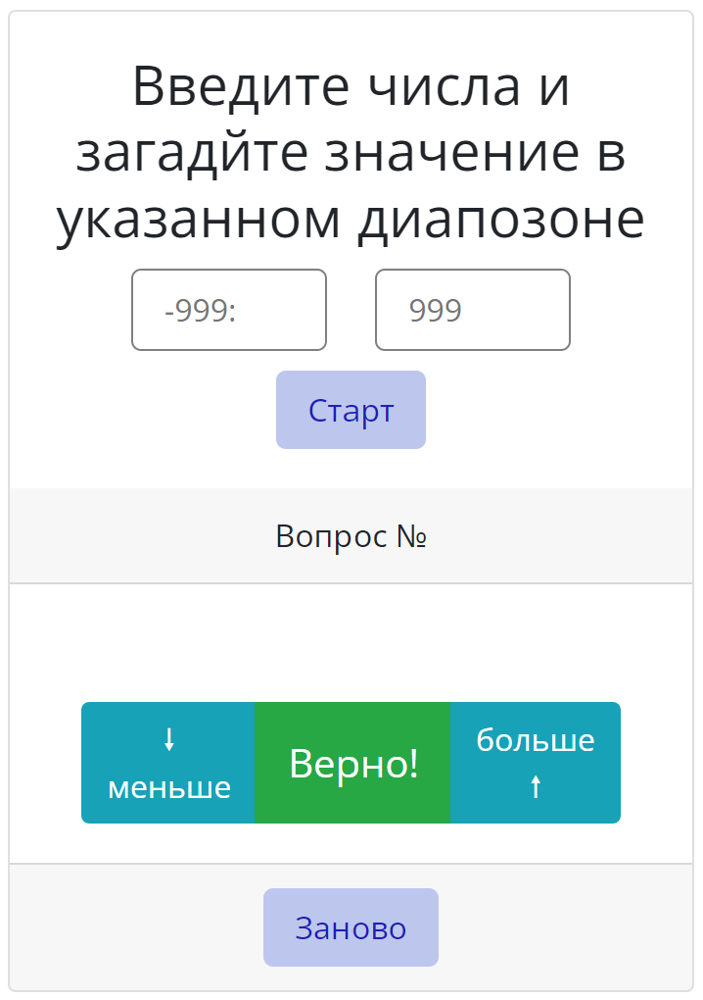

# Практическая работа модуль 8

Практическое задания в рамках курса Fullstack веб-разработчик на JavaScript и PHP:

## Задание 8.7.1 (HW-03) — Игра: угадай число

---

## Интерфейс

### Интерактивные элементы

- Поля для ввода значений диапазона;
- Кнопка "Старт";
- Блок кнопок "меньше", "Верно", "больше";
- Кнопка "Заново".

## Правила игры:

- После загрузки страницы в поля для ввода значений ввести числа от -999 до 999 или в шестнадцатеричной сисеме, например 0xff (255).
> числа выхоящие за границы указанного диапазона значений будут приведены в допустимые диапазоном границы

> любые не числовые значения будут преобразованы в числа соответвующие максимальным значениям в границах диапазона

- При нажатии кнопки "Старт" начинаеется игра. Будет выведенно сообщение с диапазоном значений. Также будет выведен вопрос о первом загаданном числе.

> если поля значений пусты, то будет выведено соответсвуещее сообщение и игра не начнется до введения значений и повторного нажатия кнопки "Старт"

> если будут введены одинаковые значения, то будет выведено соответсвующее сообщение и игра не начнется до корректировки значений и повторного нажатия кнопки "Старт"

> если значение нижней границы диапазона больше верхней, то будет выведено соответсвующее сообщение и игра не начнется до корректировки значений и повторного нажатия кнопки "Старт"

- После вывода первого предполагаемого числа если оно не соответсвует загаданному, небходимо скорректировать следущее угадываемое значение кнопками "меньше" или "больше".

> дейтвия повторяются до нахождения искомого числа (нажатие кнопки "Верно") или до завершения игры которое наступит по перебору всех возможных значений диапазона (будет выведено соответсвующее сообщение)

- При совпадении загаданного числа с предполагаемым числом необходимо нажать кнопку "Верно".

> будет выведено соответсвующее сообщение о нахождении загаданного числа

- По окончании игры можно повторить попытку начав игру нажатием кнопки "Заново".

## Используемые технологии

- HTML

- CSS в том числе Bootstrap

- JS

## Как открыть/запустить

Зайти в папку сайта в файловом менеджере, кликнуть 2 раза по файлу index.html или по [cсылке](index.html).
